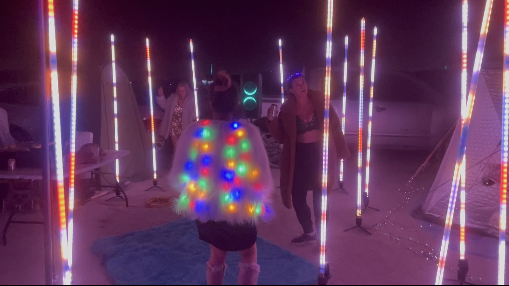

# tubes
These portable LED light poles make pretty lights for a dance party - and better yet:

They're **portable**! Convenient tripod bases keep them standing at attention, and a 10Ah USB battery (like the one you charge your phone with) will power them for about 8 hours.

They're **versatile**! You can deploy them [in a wide open space at Burning Man](https://www.youtube.com/watch?v=O0XIgyneVw4) or right next to each other [in your living room](https://www.youtube.com/watch?v=syP49iw0Vn0).

They're **coordinated**! If you put them next to each other, they sync using near-field radio. And they'll even daisy-chain, meaning the furthest ones can be really far apart as long as there are some in the middle to relay the signal.

They're also **in progress** with lots of things that could be improved.  But for now:

* they play patterns from an expanding set of "genetically-driven" combinations
* they stay in sync or deliberately drift from each other in pleasing ways
* they operate internally at a certain BPM - allowing them to sync to music

## Want your own?

They're not for sale. But see the build instructions in [this directory](assembly), complete with a parts list & assembly instructions. I'd love to help you build your own!

