# Assembly instructions
How to build your own light tubes.

Quick list of the parts involved:

* A custom PCB (printing instructions & parts are included below.)
* A [specimen cup / paint sample cup](https://www.amazon.com/gp/product/B07RYRF67N) that serves as the housing for the electronics
* A [camera tripod](https://www.amazon.com/gp/product/B072JW7PWX) that acts as the legs
* A [tripod adapter plate](https://www.amazon.com/gp/product/B00H6P57O6), used to strengthen the cup bottom.
* A [flanged nut](https://www.amazon.com/gp/product/B07MJVXWPR) that holds the base together
* The LED light tube itself
* A [shower bar flange](https://www.amazon.com/gp/product/B07K6D7D4F) that holds the light tube in place
* 3 bolts/nut pairs that mount the flange on the top of the cup
* A screw and washer that holds the LED bar against the cup top
* [Mounting foam](https://www.amazon.com/gp/product/B07NYR181P) to secure the PCB
* (Optional) Some [weighted bases](https://www.amazon.com/gp/product/B00PCS196E) that you can slip the tubes into

## The electronics

Eagle files for printing your own PCB are in the [pcb](../pcb) directory.  I used [jlcpcb.com](jlcpcb.com) to print them - fast and cheap! It's incredible that you can have PCBs from Hong Kong at our doorstep within a few days.

The tubes are "meteor lights" like [these ones](https://www.aliexpress.com/item/32678345729.html) but use the frosted plastic like [these ones](https://www.aliexpress.com/item/32977080489.html ) (note that this link is 12V LEDs, don't get those!). Ray Wu's store is universally trusted by LED artists and they do custom orders - they made me some **frosted 2m 5V 30/m SK6812s**. The great thing about these lights is that they're double-sided, for much better 360-degree view of the lights. Each "LED" in the strip is actually a front-and-back pair.

If you want to change the LEDs, for instance to use a different chipset or more LEDS per meter, it'll mostly scale to any size, but you'll need to make small updates the source. You also risk increasing the power consumption.

The code is written for a [Teensy LC](https://www.pjrc.com/teensy/teensyLC.html) microprocessor. It's a cheap, powerful CPU with some nice features for LED applications. You'll need the [Arduino](https://www.arduino.cc/) development environment to flash the code, and I recommend [VSCode](https://code.visualstudio.com/) + [PlatformIO](https://platformio.org/) for editing.

The PCB also has holes ready to accept an NRF radio. I used the ones [without an antenna](https://www.amazon.com/gp/product/B00O9O868G) in each pole. I suppose it could be redesigned around [having an antenna](https://www.amazon.com/gp/product/B07PBBC4H9) although that'll change the form factor a lot. I did use an antenna for the hand-held controller I built - see pics at end.

Finally, each PCB uses 3 [screw terminals](https://www.amazon.com/gp/product/B01MT4LC0F/) for 5v power and data connections.

There are a few improvements I'll make for future versions:

* For USB power, I cut up the USB cords that came free with the batteries I bought. But they're a little short & hard to work with when assembling the base. I'd recommend using longer ones (up to a foot long versus these 4" ones.)
* Oops. I'm going to have to fix the fact that I missed a useful/necessary wire from pin 1 to pin 17 of the Teensy. If you use these boards **you'll need to add a jumper wire** like I did, sorry! :)

## The base

The finished base will look like this:
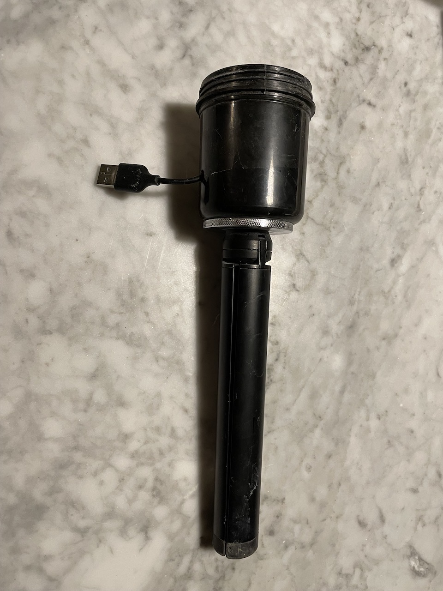
The tripod is screwed into an adapter plate that provides some stability. That adapter is screwed through a hole in the bottom of the cup, and locked in with a nut on the inside.
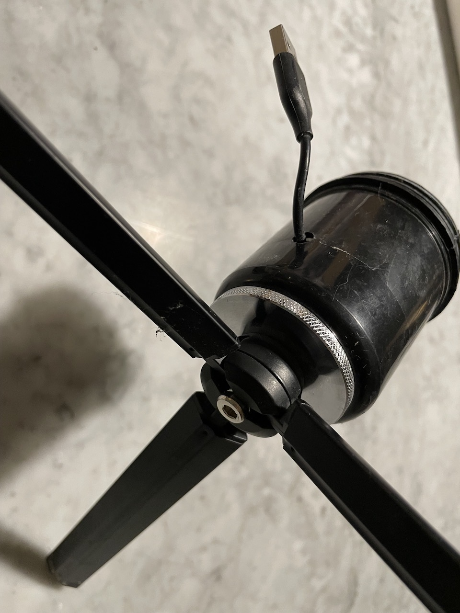

Looking down into the cup, you can see the flanged nut that holds it together:
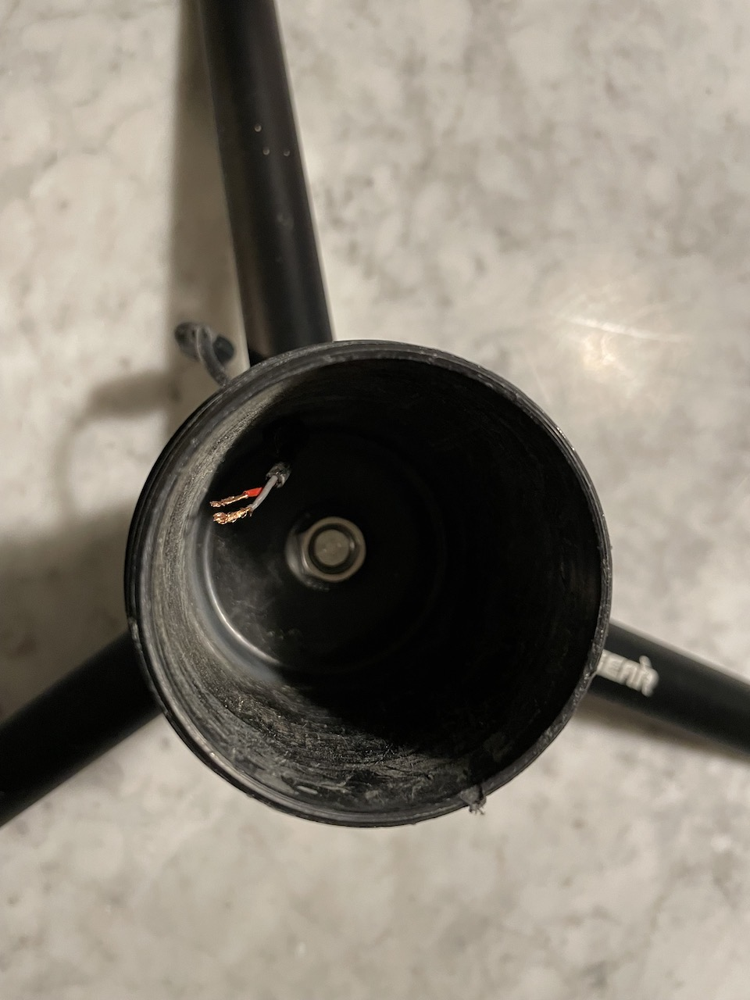

Some things I learned while building the base:

* The plastic base of the cup isn't strong enough by itself. It needs to sit on the metal adapter or else the cup will flex/deform and the whole thing will fall over.
* There are multiple kinds of tripods out there. Make sure to get the one that have the updated center screw because the older ones get loose/floppy very quickly.  You'll see mention of this in the seller's notes - they talk about a "version 2" or "updated sturdy screw".  [The Pergear](https://www.amazon.com/dp/B072JW7PWX/ref=emc_b_5_t) tripods I used have the updated bolt, [these Zeadio](https://www.amazon.com/Zeadio-Desktop-Tabletop-Stabilizer-Cameras/dp/B07GST1C2Z) ones don't.

## The tube
The finished tube will look like this:
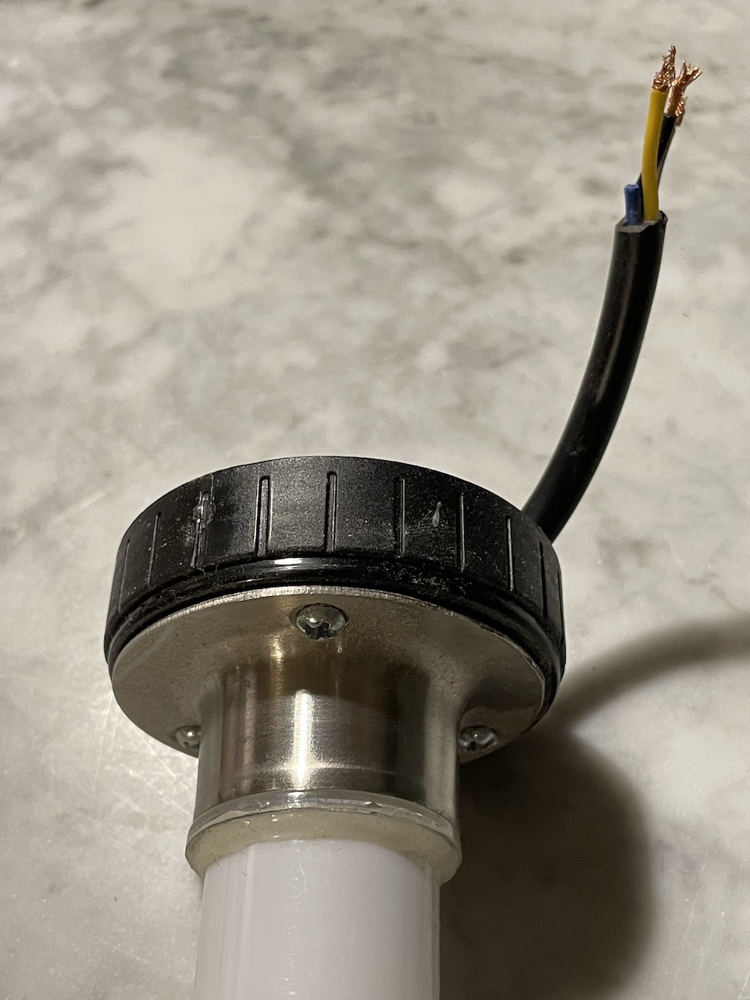
They're mounted on the top of the cup, with a flange to hold them in place.

The light tubes are pretty bare when they arrive - no easy mechanism for mounting. I found that I could give them strength by screwing into them from the bottom, but that required a special mounting plate:
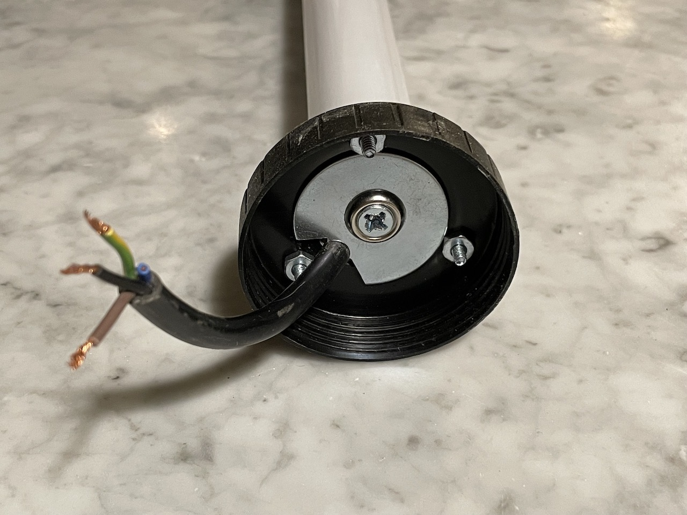

The plate is just a wide washer. I used a drill press to make a hole for the LED strip connector wires, then opened it up a bit with a band saw. You might not need to do that, but it made it easier to get the wires through.

A screw goes up through the washer into the plastic of the tube. It wouldn't be strong enough by itself (the plastic would crack with any pressure on the tube) so the flange on the other side holds it in place. Then the flange can be screwed in from the other side.

Some advice:
* Pre-drill the holes in the cup top. Each will have four holes: three small ones for the flange's screws and one large center one. The center one has to be pretty big to accommodate the wires - I mader mine about an inch wide. The washer/screw combo is clamping the tube to the cup top, so make sure there's enough of the top left to give it strength.
* Also pre-drill a hole into the tube, to prevent the plastic from cracking under strain when you screw into it.
* Between the width of the flat washer and the nuts that hold the flange on, it's pretty tight for space. In my case the nuts just barely fit around the outside of the washer, so screw those 3 in first, and then do the center washer. As a side effect this also keeps the nuts from coming loose, because the washer is keeping them from turning.

## The guts
With the tube and base ready, it's time to fill up the specimen cup. With a PCB!

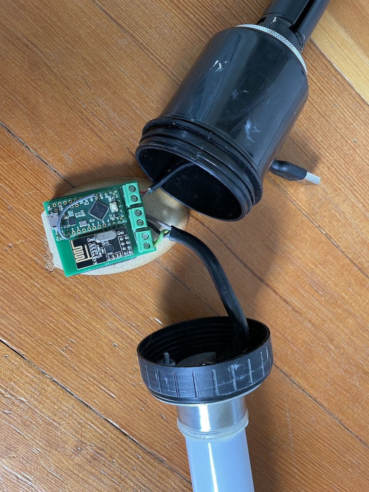

My friend laser cut me some elliptical wooden discs to mount the PCBs on:

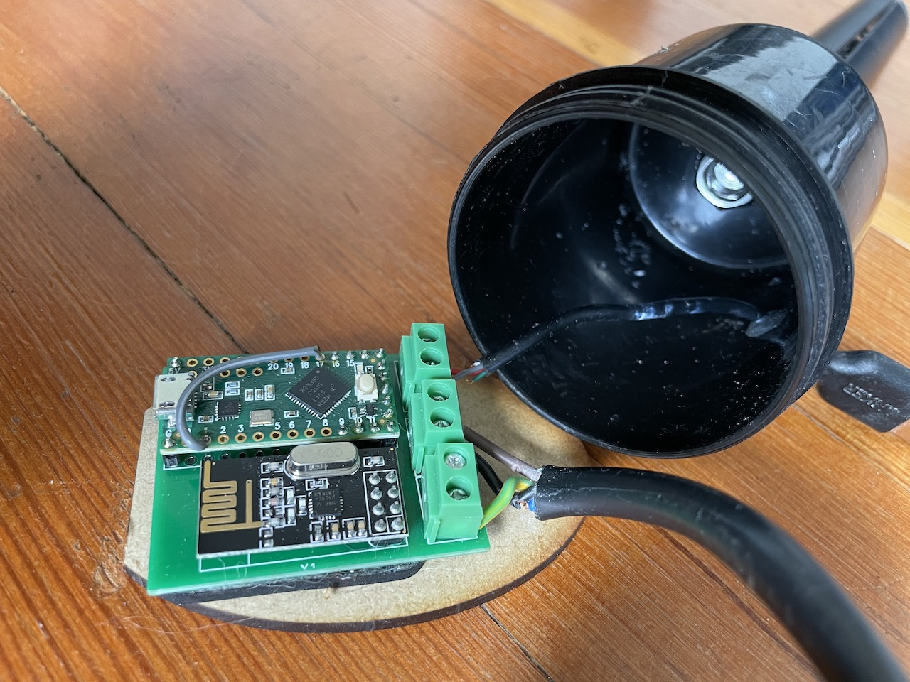

They provide some stability to keep the PCB from bouncing around inside the cup. But you could use anything to mount them. The important thing is to not let the PCBs touch the other metal in the cup - the nut on the bottom or the washer & fasteners on the top.

I used double-sided mounting foam to stick the PCB to the wood.  If you don't want to laser cut the wood, maybe you can use the same stuff to make some non-conductive circles and cover the nut and the washer instead.

Lessons learned:

* The cup top screws on to the cup bottom. When you do this, you're going to twist up the wires that are attached to the PCB unless it can freely rotate inside the cup, and even then they'll probably have some twist on them. Make sure the ends of the wires are long enough that they don't get pulled out of the screw terminals.
* The screw top of the cup feels like a weak point, since the top pops off with a little force. Turns out this is a feature not a bug!  By giving the whole thing a bit of a deliberate weak point, it takes pressure off the -true- weak point, which is the glue they used to make the tubes. If you hold everything else solidly together, the tubes themselves will break when a pole falls over!

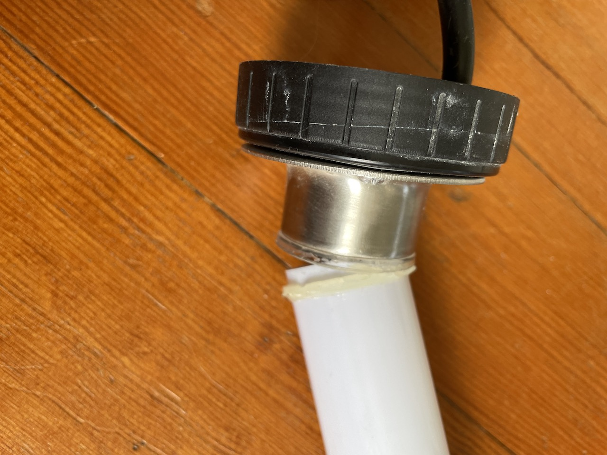

## The controller (optional)

Okay, this part is totally awesome/embarassing.

The day before leaving for Burning Man, I made myself a new toy.

The tubes normally work really well and sync automatically. But their range is limited by the fact that the NRF chips don't have a very big antenna. Occasionally they'll even be right next to each other and still not see each other, in which case one or two might drift apart from the rest.

To achieve perfect coordination, I built a hand-held controller which has the same PCB, but this time I used an [NRF with a big antenna](https://www.amazon.com/gp/product/B07PBBC4H9). It has a special ID that the tubes will always obey, so it acts as a dictator with special powers. It gets them all in sync even if they're 50+ feet apart. And while I was building it, I added some UI to force them to change patterns, colors, and tempo.

It's super useful and also the ugliest thing I've ever built.

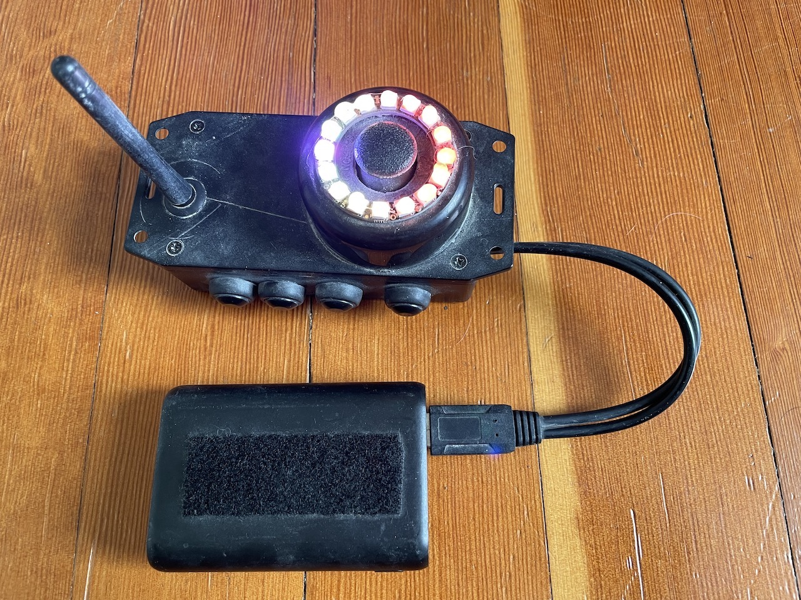

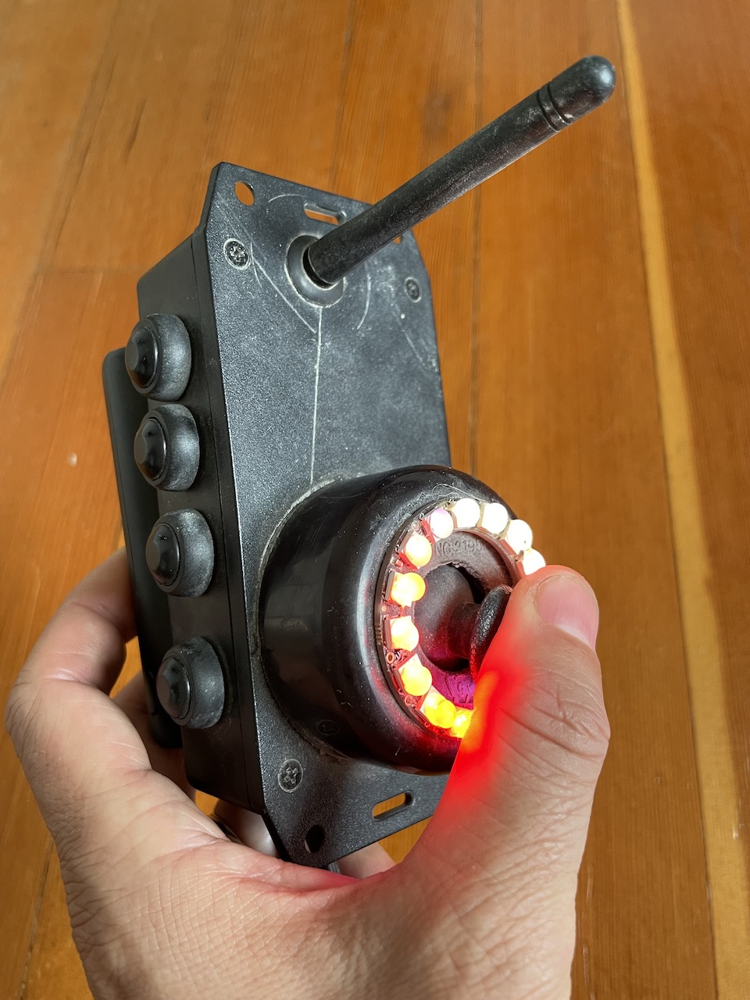

I'm not going to do full build instructions for this, but maybe it'll inspire you to make your own. I used parts I had on hand:

* A project box for the body
* The same PCB, now with greater range & a special version of the software
* A rotational joystick like on an Xbox/PS controller
* The bottom of one of the cups as a base for the joystick
* Four pushbuttons
* A 16-LED ring around the joystick
* Hot glue(!) to make diffusers for the LEDs, otherwise they're painfully bright
* Velcro to securely attach a battery under this very ergonomic device
* A [Y-split USB-to-microUSB](https://www.amazon.com/gp/product/B0179OXY9I) cable

The whole thing is such a mess inside:

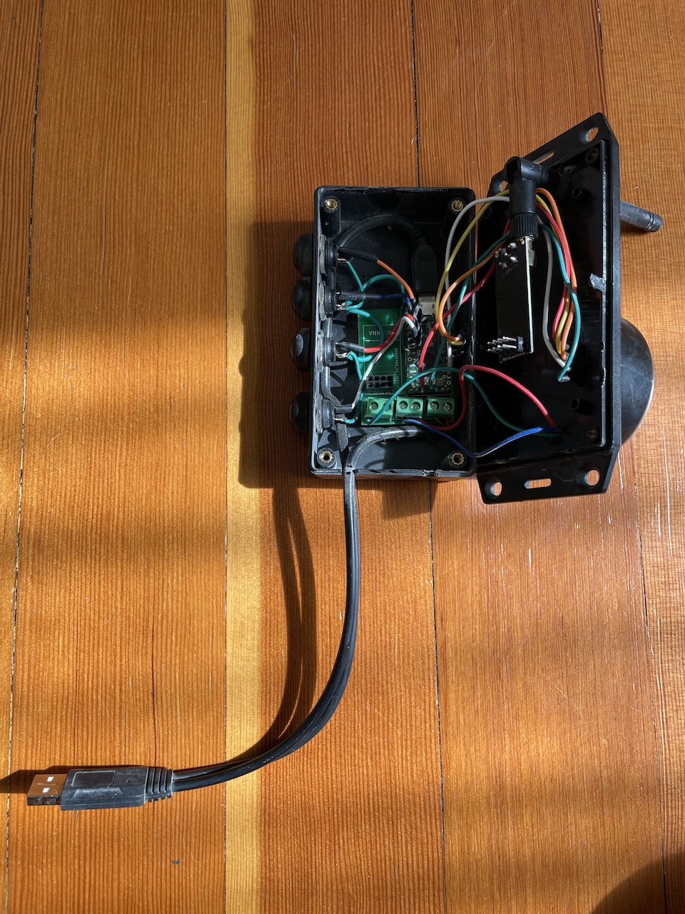

The controller is really just the same light tube PCB and software with a different housing and some inputs. The lights around the joystick show a "thumbnail" (16-LED version) of the pattern it's broadcasting, with a super-imposed white LED marking the current beat.

Besides the extended antenna range, the most useful feature of the controller is setting the BPM of the light poles. One of the buttons lets you tap out a 16-count beat: hold/release, hold/release, hold/release, hold/release, hold/release, hold/release, hold/release, hold/release. The patterns adapt to the new BPM you just tapped out. It's not perfect, so there's beat drift, but it works well enough for now...

[Here's a video showing how it works](https://youtu.be/DNYU71bFSdg). 

After a BPM reset, any nearby light tubes will all be doing the same thing that the controller displays, for instance in this video they're flashing at the start of each beat phrase. The light tubes only do effect changes at the start of a phrase, so things continue to stay in sync until the bpm drifts.

It can also be used to force the tubes into a specific color set, by holding another button and rotating the joystick. Then I still had two unused buttons so I made an intensity control (hold button, use the stick to brighten or dim) and ... some other feature that I forgot. I don't really use those buttons. I'll probably find more useful things for them to do.

Things I learned from this hacked-together experiment:

* In this version of the PCB, I socketed the NRF radio - but the antenna is directly attached to the NRF board, limiting where it can be placed given that the whole thing is mounted on a PCB. I drilled a hole in the enclosure, and used a grommet to hold the antenna tightly in place. It sticks right out from the front of the remote, which isn't pretty!
* I used a split USB cord this time, with one end plugged into the Teensy's microUSB port and one plugged into the screw terminals. Having a data connection means I can flash the controller's software without taking it apart. I'm going to try to do this for the light poles eventually too, but there's not enough room inside the cup for the cable to plug into the Teensy. Maybe there's a right-angle connector that would work.
* The light poles are way cooler when they're in sync with the beat!
* Rotational UI feels great but it's not very precise, so it's still too hard to select specific colors or patterns using the joystick.